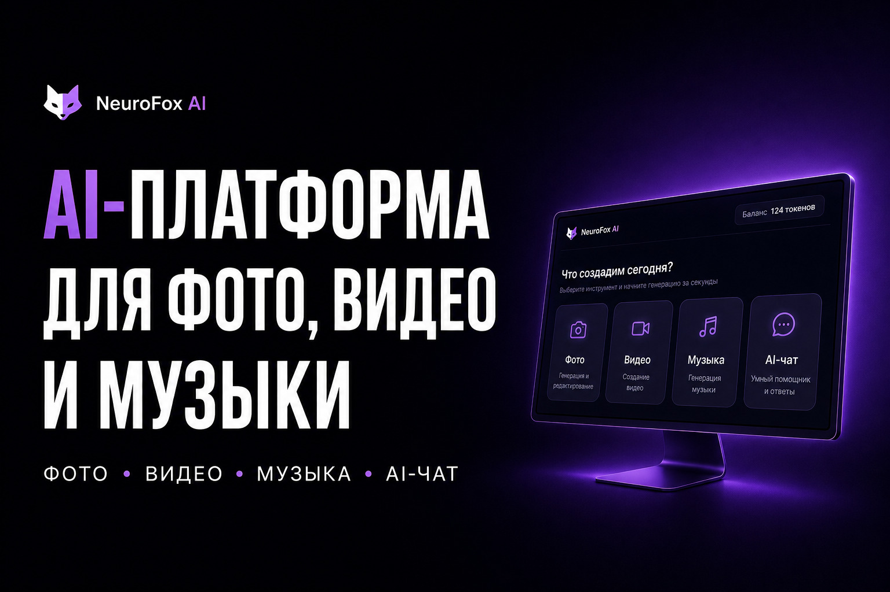
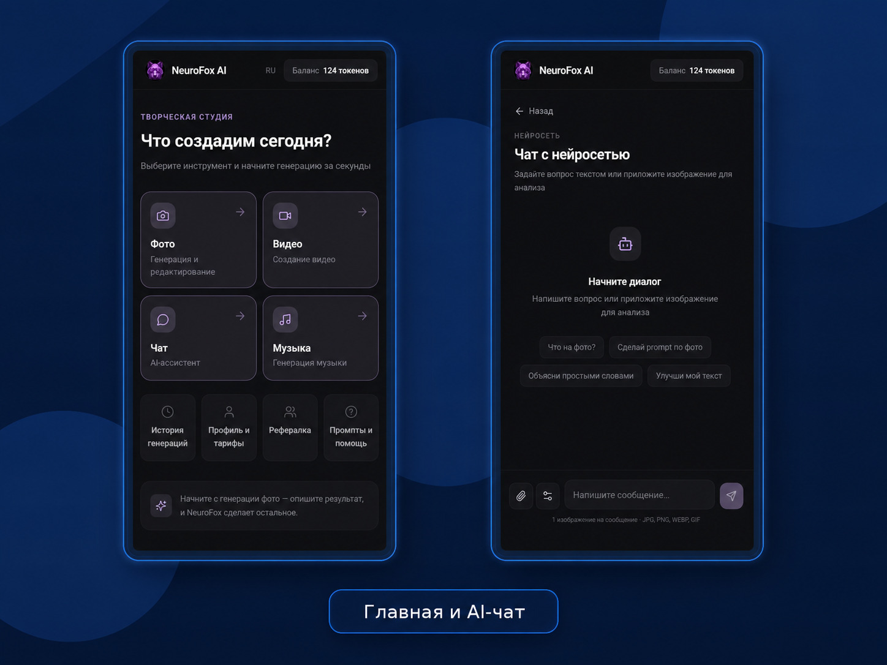
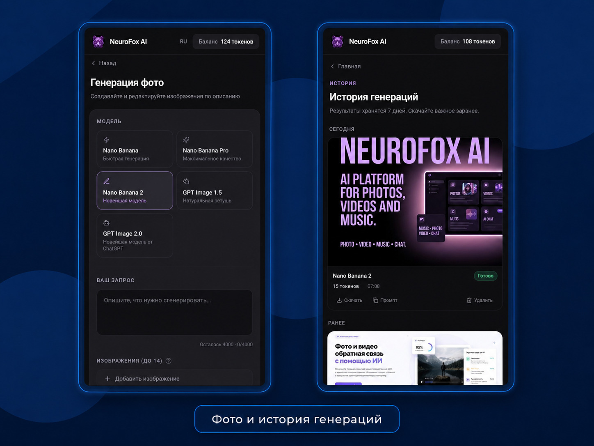
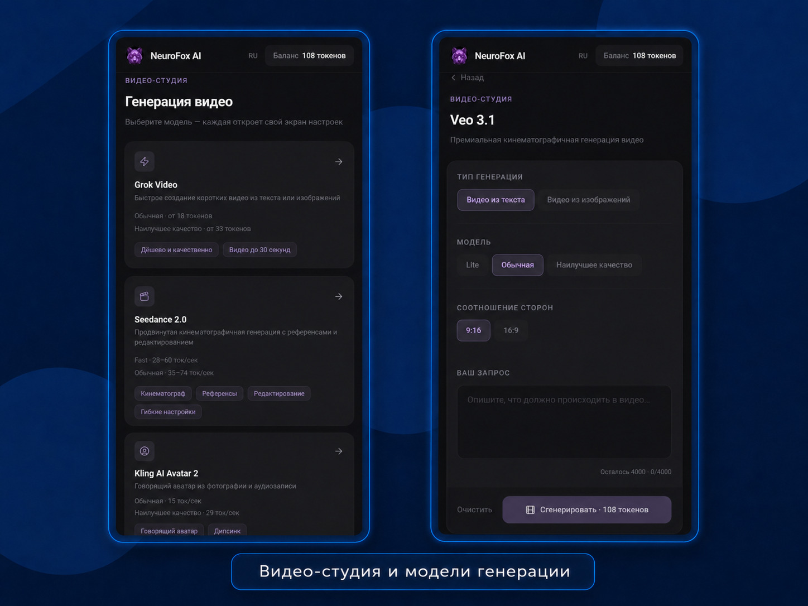
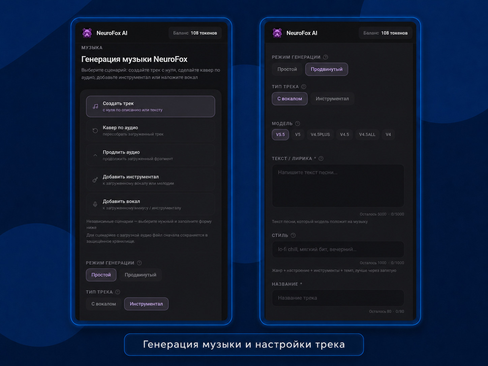

**NeuroFox AI** собирает популярные нейросети в одном кабинете. Пользователь пополняет баланс один раз и дальше делает фото, видео, музыку или спрашивает AI-чат, не заводя пять подписок.

<h3 align="center"><a href="https://neurofox.art">Открыть в браузере »</a>&emsp;&emsp;&emsp;&emsp;&emsp;&emsp;<a href="https://t.me/Malinovsky_AI_bot">Бот в Telegram »</a></h3>

Работающий сервис заказчика, вход по email.

<table>
<tr>
<td width="50%"></td>
<td width="50%"></td>
</tr>
<tr>
<td></td>
<td></td>
</tr>
</table>

Под капотом всё, что нужно платному сервису: тарифы и оплата, баланс токенов, стартовые токены новичкам, история генераций и реферальная программа с выплатами. Одинаково удобно с телефона и с компьютера.

Для разработчиков

Здесь несколько файлов, по которым видно подход. Ключей, платежей и данных пользователей в репозитории нет.

- `backend/README.md`: как устроен сервер: модули, API, фоновые задачи, база.
- `backend/financial-policy.mjs`: деньги реферальной программы: начисления, откаты и резервы при выплатах.
- `src/pages/History.tsx`: история генераций: фото, видео и музыка в одной ленте.
- `src/test/generated-result-materialization.test.ts`: проверки, что готовые файлы от нейросетей сохраняются надёжно и без утечки ссылок.

React 18, TypeScript, Vite, Tailwind CSS, Node.js, PostgreSQL, Docker. Полный код закрыт и показывается по запросу.

Нужен похожий сервис с оплатой и личным кабинетом? Напишите в [Telegram](https://t.me/qxstay).
